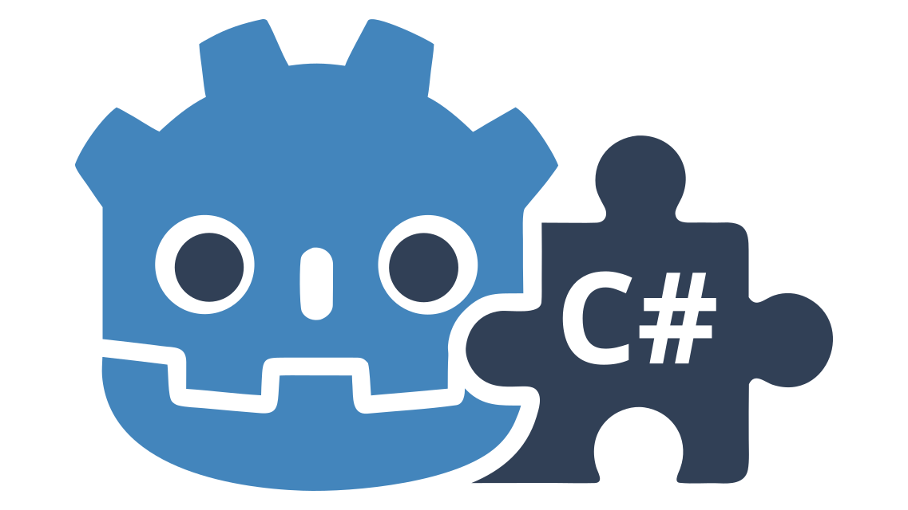

<div align="center">



# ePlugin Framework

**Extended C# Plugin Framework for [Godot](https://godotengine.org/).**


**NOTE**: This is currently in an experimental state and very much WIP!

</div>

## Features

+ Easy-to-use fluent API for plugins
+ on plugin activation/deactivation handling of
    + Project References
    + NuGet References
    + include/exclude Asset directories (for additional content)
+ Plugin Migration (version upgrades)
+ Plugin Dependencies (when a root plugin is disabled, all dependent plugins will be disabled too)

## Why?

Godot's current plugin system has a few major drawbacks (especially for C#)

+ Editor plugin code lives in the same project as game code (every change to C# code will trigger an AssemblyContext
  reload losing all state)
+ C# specific features like project references or NuGet packages are not supported (for plugins)
+ Code that uses external references cannot be compiled (manually installing C# plugins is complex). Plugins cannot be
  easily distributed in Godot's AssetLib.
+ for plugins in separate projects or NuGets Godot does not find global classes, which makes it impossible to
  externalize components (see: [issue #95036](https://github.com/godotengine/godot/issues/95036))

As long as the state of Godot's plugin system and C# integration is as it is now, this extending framework tries to
provide some of the missing pieces for C# Plugins.

## Drawbacks

+ Activating/Deactivating an ePlugin will freeze Godot's UI for the duration of installation/deinstallation of that
  plugin
+ if an error happens during installation or deinstallation, the projects might be left in a non-compilable state and
  needs manual intervention.
+ The Godot editors plugin UI will not refresh. Activated dependant plugins will not be shown in the plugin UI till it
  is reopened.

## What is not possible?

+ The current system does not allow for external Assets (Scenes, Models, Scripts, aso.) as Godot needs a unique Id for
  each Asset and this is not supported for external elements. But it is possible to add them using a subdirectory of the
  plugin that will be included on activation.

## Testing

This needs more external plugins and testing to move forward. Feel free to participate and provide feedback.

Tested on:

+ Godot 4.7.0 Beta 1 + .NET 10
+ Godot 4.6.2 + .NET 10
+ Godot 4.5.1 + .NET 10
+ Godot 4.4.1 + .NET 10

Godot 4.5 and newer have a regression with
EditorPlugins [Issue #110971](https://github.com/godotengine/godot/issues/110971). This is why an Interface approach is
used here.

gdUnit is used as the test framework, but editor tests are not possible right
now ([Issue #911](https://github.com/MikeSchulze/gdUnit4/issues/911))

## Examples

### Example Code (Basic Plugin)

```C#
#if TOOLS
using Godot;
using Enaweg.Plugin;

namespace Enaweg.Plugin.Sample;

[Tool]
public partial class SamplePlugin : EditorPlugin, IEEditorPlugin
{
    public EditorPlugin GodotPlugin => this;

    public void Bootstrap(IEEditorPluginBuilder builder)
    {
        // build your plugin setup here
    }

    public override void _EnablePlugin()
    {
        base._EnablePlugin();
        // lifetime call to ePlugin
        this.EnableEPlugin();
    }

    public override void _DisablePlugin()
    {
        base._DisablePlugin();
        // lifetime call to ePlugin
        this.DisableEPlugin();
    }
}
#endif
```

### Example Code (Advanced Plugin)

```C#
#if TOOLS
using Godot;
using Enaweg.Plugin;

namespace Enaweg.Sample;

[Tool]
public sealed partial class YourPlugin : EditorPlugin, IEEditorPlugin
{
    public EditorPlugin GodotPlugin => this;

    public void Bootstrap(IEEditorPluginBuilder builder)
    {
        builder
            // add multiple nugets at once (latest stable releases)
            .AddNuget("Sample.Nuget.Package1a", "Sample.Nuget.Package1b")
            
            // add specific nuget versions from a source URL
            .AddNuget("Sample.Nuget.Package2", ">2.0", "https://www.nuget.org/")
            
            // add specific nuget version from a local directory
            .AddNuget("Sample.Nuget.Package2", ">2.0", "res://path-to-nuget-directory")
            
            // add a dependency to any plugin (C# or normal GDScript Plugin)
            .AddPluginDependency("other-plugin", "2.0")
            
            // add autoload
            .AddAutoload("ResourceName", "res://path-to-resource")
            
            // add project reference to solution (and Godot's project if last parameter is true)
            // projects can be included in a hidden directory
            .AddProject("project path", "virtual Folder", true)
            
            // add a directory to show/hide depending on plugin state
            // plugins need to be provided in a deactivated state to users
            .AddDirectory($"{PluginDirectory}/.src");
    }
    
    public override void _EnablePlugin()
    {
        base._EnablePlugin();
        // lifetime call to ePlugin
        this.EnableEPlugin();
    }

    public override void _DisablePlugin()
    {
        base._DisablePlugin();
        // lifetime call to ePlugin
        this.DisableEPlugin();
    }
}

#endif
```

## Contribute

Feel free to contribute with Documentation, Testing, or PRs.

## Roadmap

* stabilize current API
* improve documentation
* automated testing

### Future

* add simple UI API (show progress for plugins loading) for improved UX.
* provide more APIs for plugins to use (Vision: make it easy to have advanced features for plugin authors)
    * Automatic plugin update system using source URL
    * Plugin specific UI templates (licenses, feedback, Welcome screen)

## Commercial Support

Commercial services are available from [Enaweg](https://www.enaweg.at). If you need consulting, implementation
assistance, or tailored development services, please get in touch through their website.

## License

Licensed under the MIT license, see `LICENSE` for more information.
