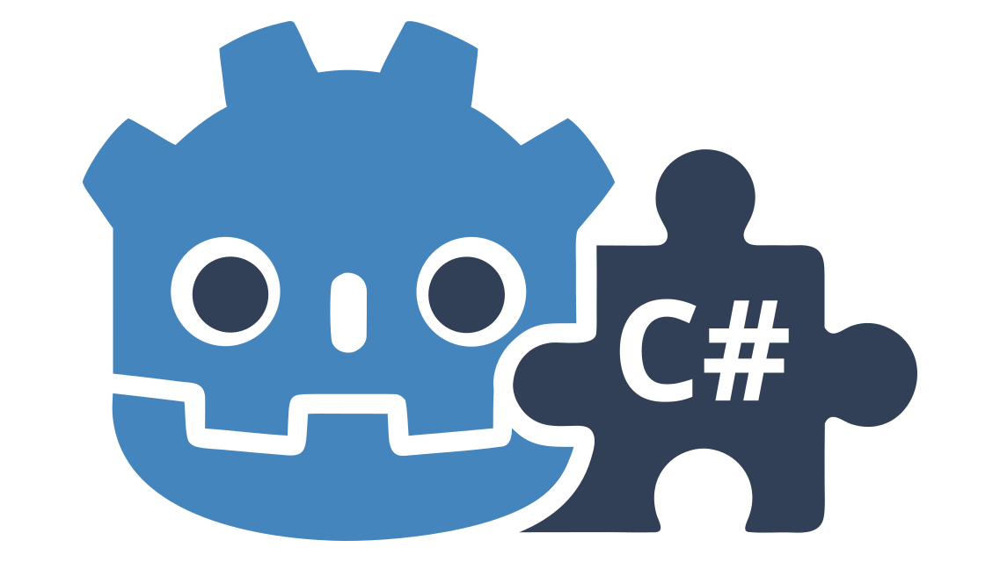

<div align="center">



# ePlugin Framework

**Extended C# Plugin Framework for [Godot](https://godotengine.org/).**

[](https://github.com/enaweg/godot-epluginframework/actions/workflows/ci-pr.yml)


**NOTE**: This project is experimental and still a work in progress.

</div>

## Requirements

The current CI-tested configuration uses:

+ [Godot 4.7.2 .NET](https://godotengine.org/download/archive/4.7.2-stable/)
+ [.NET 8 SDK](https://dotnet.microsoft.com/download/dotnet/8.0)

The project targets `net8.0`. Earlier tested Godot and .NET combinations are listed in the
[Testing](#testing) section.

## Installation

1. Install [ePlugin Framework from the Godot Asset Store](https://store.godotengine.org/asset/enaweg/eplugin-framework/).
2. Alternatively, download the latest [ePlugin release](https://github.com/enaweg/godot-epluginframework/releases) and extract the archive's `addons/ePlugin` directory into your Godot project's `addons` directory.
3. Open the project in the Godot .NET editor and enable **ePlugin** under **Project > Project Settings > Plugins**.
4. Enable the plugins that implement `IEEditorPlugin`.

The repository also contains a sample project in `src/eplugin-framework`.

## Features

+ Easy-to-use fluent API for plugins
+ Plugin activation/deactivation handling for:
    + Project References
+ NuGet package references; external and local sources can be persisted in the project-root `nuget.config`
+ Include/exclude asset directories (for additional content)
+ Plugin Migration (version upgrades)
+ Plugin Dependencies (when a root plugin is disabled, all dependent plugins will be disabled too)
+ Optional Plugin Dependencies with their own nested recipe, installed and removed as the other plugin is
  enabled and disabled

## Motivation

Godot's plugin system has a few major drawbacks, especially for C# plugins:

+ Editor plugin code lives in the same project as game code (every change to C# code will trigger an AssemblyContext
  reload losing all state)
+ C# specific features like project references or NuGet packages are not supported (for plugins)
+ Code that uses external references cannot be compiled (manually installing C# plugins is complex). Plugins cannot be
  easily distributed in Godot's AssetLib.
+ For plugins in separate projects or NuGet packages, Godot does not find global classes, which makes it impossible to
  externalize components (see: [issue #95036](https://github.com/godotengine/godot/issues/95036))

As long as the state of Godot's plugin system and C# integration is as it is now, this extending framework tries to
provide some of the missing pieces for C# Plugins.

## Drawbacks

+ Activating or deactivating an ePlugin freezes Godot's UI while it installs or uninstalls the
  plugin
+ If an error occurs during installation or uninstallation, the project may be left in a non-compilable state and
  require manual intervention.
+ Godot's editor plugin UI does not refresh automatically. Activated dependent plugins may not be shown until the UI
  is reopened.
+ Optional plugin dependencies are only re-evaluated when an ePlugin-managed plugin is enabled or disabled.
  Enabling or disabling a plain Godot plugin (one that does not implement `IEEditorPlugin`) does not trigger
  it, so a nested recipe depending on such a plugin is only applied or removed once the declaring plugin is
  toggled itself.

## What is not possible?

+ External assets (scenes, models, scripts, etc.) cannot currently be managed outside the project because Godot needs
  project-managed resource IDs. Assets can still be included in a plugin subdirectory and made available on activation.

## Testing

This project needs more external plugins and testing to move forward. Feel free to participate and provide feedback.

The current CI configuration builds and tests pull requests with Godot 4.7.2 and .NET 8.

Tested combinations:

+ Godot 4.7.2 + .NET 8 (CI-tested)
+ Godot 4.6.2 + .NET 10
+ Godot 4.5.1 + .NET 10
+ Godot 4.4.1 + .NET 10

To build and run the tests locally:

```bash
cd src/eplugin-framework
dotnet build "EPlugin Framework.sln" --configuration Debug
dotnet test "EPlugin Framework.sln" --configuration Debug --settings .runsettings
```

See the [CI workflow](https://github.com/enaweg/godot-epluginframework/blob/main/.github/workflows/ci-pr.yml)
for the complete headless test setup.

Godot 4.5 and newer have a regression with
EditorPlugins [Issue #110971](https://github.com/godotengine/godot/issues/110971). This is why an Interface approach is
used here.

gdUnit is used as the test framework, but editor tests are not possible right
now ([Issue #911](https://github.com/MikeSchulze/gdUnit4/issues/911))

## Examples

### Example Code (Basic Plugin)

```C#
#if TOOLS
using Godot;
using Enaweg.Plugin;

namespace Enaweg.Plugin.Sample;

[Tool]
public partial class SamplePlugin : EditorPlugin, IEEditorPlugin
{
    public void CreateRecipe(IEEditorPluginBuilder builder)
    {
        // build your plugin setup here
    }

    public override void _EnablePlugin()
    {
        base._EnablePlugin();
        // lifetime call to ePlugin
        this.EnableEPlugin();
    }

    public override void _DisablePlugin()
    {
        base._DisablePlugin();
        // lifetime call to ePlugin
        this.DisableEPlugin();
    }
}
#endif
```

### Example Code (Advanced Plugin)

```C#
#if TOOLS
using Godot;
using Enaweg.Plugin;

namespace Enaweg.Sample;

[Tool]
public sealed partial class YourPlugin : EditorPlugin, IEEditorPlugin
{
    public void CreateRecipe(IEEditorPluginBuilder builder)
    {
        builder
            // add multiple nugets at once (latest stable releases)
            .AddNugets("Sample.Nuget.Package1a", "Sample.Nuget.Package1b")
            
            // add an exact nuget version from a source URL
            .AddNuget("Sample.Nuget.Package2", "2.0.0", "https://api.nuget.org/v3/index.json")
            
            // add an exact nuget version from a local directory
            .AddNuget("Sample.Nuget.Package2", "2.0.0", "res://path-to-nuget-directory")
            
            // add a dependency to any plugin (C# or normal GDScript Plugin)
            .AddPluginDependency("other-plugin", ">2.0.0")
            
            // add an OPTIONAL dependency with its own recipe: the nested recipe is only installed
            // when that plugin is already enabled (and matches the version). It is never enabled
            // automatically and a missing/mismatched plugin never fails this plugin.
            .AddOptionalPluginDependency("optional-plugin", ">1.0.0", optional => optional
                .AddNuget("Sample.Nuget.Package3")
                .AddProject("optional project path")
                .AddAutoload("OptionalResourceName", "res://path-to-optional-resource")
                .AddDirectory($"{this.GetPluginDirectory()}/.optional-src"))
            
            // add autoload
            .AddAutoload("ResourceName", "res://path-to-resource")
            
            // add project reference to solution (and Godot's project if last parameter is true)
            // projects can be included in a hidden directory
            .AddProject("project path", "virtual Folder", true)
            
            // add a directory to show/hide depending on plugin state
            // plugins need to be provided in a deactivated state to users
            .AddDirectory($"{this.GetPluginDirectory()}/.src");
    }
    
    public override void _EnablePlugin()
    {
        base._EnablePlugin();
        // lifetime call to ePlugin
        this.EnableEPlugin();
    }

    public override void _DisablePlugin()
    {
        base._DisablePlugin();
        // lifetime call to ePlugin
        this.DisableEPlugin();
    }
}

#endif
```

### Example Code (Optional Plugin Dependency)

A plugin can declare that it does *extra* work while another plugin happens to be around — for example
registering an integration project, an autoload or a directory of glue code. `AddOptionalPluginDependency`
takes the slug of that plugin, an optional version constraint, and a nested recipe:

```C#
#if TOOLS
using Godot;
using Enaweg.Plugin;

[Tool]
public partial class YourPlugin : EditorPlugin, IEEditorPlugin
{
    public void CreateRecipe(IEEditorPluginBuilder builder)
    {
        builder
            // installed whenever this plugin is active
            .AddDirectory($"{this.GetPluginDirectory()}/.src")

            // installed only while "other-plugin" is enabled and at least version 1.0
            .AddOptionalPluginDependency("other-plugin", ">1.0", optional => optional
                .AddNuget("Sample.Nuget.Package")
                .AddProject("addons/your-plugin/Integration.csproj")
                .AddAutoload("IntegrationName", "res://path-to-integration-resource")
                .AddDirectory($"{this.GetPluginDirectory()}/.optional-src"));
    }

    public override void _EnablePlugin()
    {
        base._EnablePlugin();
        this.EnableEPlugin();
    }

    public override void _DisablePlugin()
    {
        base._DisablePlugin();
        this.DisableEPlugin();
    }
}
#endif
```

How it behaves:

+ **Optional means optional.** The named plugin is never enabled on your behalf. When it is missing, disabled,
  or its version does not match, the nested recipe is skipped, a line is logged, and your plugin activates
  normally. This is the difference to `AddPluginDependency`, which enables the dependency and fails your
  plugin when it cannot be satisfied.
+ **Activation order does not matter.** Enabling the other plugin later installs the nested recipe at that
  point, even though your plugin was activated first.
+ **Disabling the other plugin removes the nested recipe again**, so nothing is left referencing a plugin that
  is gone and the project keeps compiling. Your plugin itself stays enabled — optional dependencies never
  cascade a disable, unlike `AddPluginDependency`.
+ **Version constraints** use the same syntax as `AddPluginDependency` (`"1.2.3"` for an exact version,
  `">1.2.0"` for "this version or higher"). Pass `null` to accept any version.
+ **Nested recipes declare resources only** — `AddNuget`, `AddNugets`, `AddProject`, `AddAutoload` and
  `AddDirectory`. They cannot declare dependencies of their own; only the root recipe can.

`addons/sample_optional_plugin` in this repository is a working example: it optionally depends on
`addons/sample_plugin` and manages a directory of integration code alongside its own.

## Plugins using ePlugin Framework

+ [godot-elogger](https://github.com/enaweg/godot-elogger)
+ [godot-econtainer](https://github.com/enaweg/godot-econtainer)

## Contribute

Feel free to contribute with documentation, testing, or pull requests.

## Roadmap

* stabilize current API
* improve documentation
* expand automated testing

### Future

* add simple UI API (show progress for plugins loading) for improved UX.
* provide more APIs for plugins to use (Vision: make it easy to have advanced features for plugin authors)
    * Automatic plugin update system using source URL
    * Plugin specific UI templates (licenses, feedback, Welcome screen)

## Commercial Support

Commercial services are available from [Enaweg](https://www.enaweg.at). If you need consulting, implementation
assistance, or tailored development services, please get in touch through their website.

## License

Licensed under the [MIT license](LICENSE).
