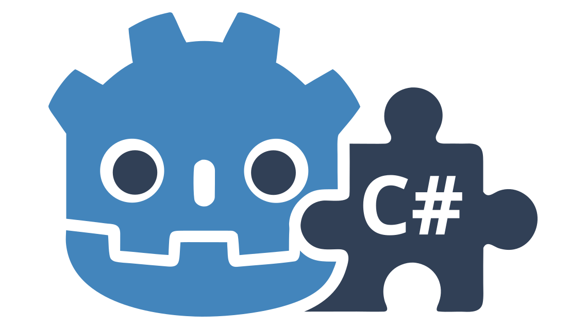

<div align="center">



# ePlugin Framework

**Extended C# Plugin Framework for [Godot](https://godotengine.org/).**

[](https://github.com/enaweg/godot-epluginframework/actions/workflows/ci-pr.yml)


</div>

## Requirements

The current CI-tested configuration uses:

+ [Godot 4.7.2 .NET](https://godotengine.org/download/archive/4.7.2-stable/)
+ [.NET 8 SDK](https://dotnet.microsoft.com/download/dotnet/8.0)

The project targets `net8.0`. Earlier tested Godot and .NET combinations are listed in the
[Testing](#testing) section.

## Installation

1. Install [ePlugin Framework from the Godot Asset Store](https://store.godotengine.org/asset/enaweg/eplugin-framework/).
2. Alternatively, download the latest [ePlugin release](https://github.com/enaweg/godot-epluginframework/releases) and extract the archive's `addons/ePlugin` directory into your Godot project's `addons` directory.
3. Open the project in the Godot .NET editor and enable **ePlugin** under **Project > Project Settings > Plugins**.
4. Enable the plugins that implement `IEEditorPlugin`.

Release archives include a small progress helper (about 20 KB, shared by all platforms) that runs on the installed
.NET runtime and draws its window with the native UI of Windows, macOS, or Linux (GTK 3). A source checkout does not
include the generated helper; without it, or without GTK 3 on Linux, activation and deactivation run normally without
a progress window. Asset Library distributions should use the release archive so they include the helper.

The repository also contains a sample project in `src/eplugin-framework`.

## Features

+ Fluent, declarative API: a plugin declares what it needs in `CreateRecipe`, and the framework installs it
  when the plugin is enabled and reverses it when the plugin is disabled.
+ Resources a recipe can declare:
    + **NuGet packages** — with an optional exact version and feed source. External and local sources are
      mirrored into the project-root `nuget.config`, so a fresh checkout can restore them.
    + **C# projects** — added to the solution (optionally inside a solution folder) and referenced from the
      main Godot project.
    + **Autoload singletons** — registered on activation, removed on deactivation.
    + **Directories** — shown while the plugin is active and hidden while it is not, so a plugin can ship
      source or assets that stay inert until it is enabled.
+ **Plugin dependencies**: a required plugin (C# or GDScript) is enabled before the dependent plugin and
  checked against an optional version constraint. Disabling it also disables every plugin that depends on it.
+ **Optional plugin dependencies** with their own nested recipe, installed and removed as the other plugin
  is enabled and disabled — never enabling it and never failing activation.
+ **Survives C# assembly reloads**: the editor drops all static state on a reload, so the framework rebuilds
  its plugin state from the plugins that are currently active.
+ **Startup initializers**: code shipped inside a managed directory can register an `IInitialize` via
  `EPlugin.RegisterInitializer` and get called once the framework is up (see `addons/sample_addedcode_plugin`).
+ **Plugin helpers** for authors: `GetPluginSlug()`, `GetPluginDirectory()`, `ReadMetadata()` and `Cli()`
  extensions on `EditorPlugin`.
+ The editor's filesystem is rescanned and the solution rebuilt after every install and uninstall.
+ When Project Settings is open, it is temporarily hidden during plugin activation or deactivation and reopened
  afterwards on the same tab, refreshing the Plugins list including automatically toggled dependencies.

Enabled addons can be checked and updated from release or git sources; see [Updating plugins](#updating-plugins).

## ePlugin Manager

Open the **ePlugin Manager** with the ePlugin button at the right of the editor's main toolbar or with
**Project > Tools > ePlugin Manager...**. It lists every plugin below `res://addons`, enabled or not, with its
type (ePlugin Framework, ePlugin, C# plugin, GDScript plugin) and version. ePlugins are marked with the ePlugin
icon. Plugins with an `update_url` show an update icon that turns green when an update is available.

Select a plugin to see its details next to the list: status, author, description, the available update
(installed → new version, source, warnings and earlier failures), and the dependencies of an active ePlugin's
recipe. From the dialog you can:

+ **Check for updates** — checks now, regardless of the check interval.
+ **Update** — installs the checked updates (see [Updating plugins](#updating-plugins)).
+ **Retry failed** — retries plugins whose activation, deactivation or update failed or was interrupted.
+ **Open release page** — opens the release notes of the selected plugin's update.

## Plugin state files

The framework creates `res://addons/eplugin-state.json` from the currently active plugins (both ePlugin-managed and plain Godot plugins) when the file is
missing. Commit this JSON file with your addon files. It records the last acknowledged plugin versions and completed
activation or deactivation states, including ePlugin itself. The first snapshot is a baseline of the current editor
state; it cannot recover versions installed before the file existed. Later changes to `plugin.cfg` do not advance the
acknowledged version until a migration or update completes.

Plain GDScript and C# plugins are observed on demand at startup and before manual retry, without polling.
Later consumers of the index explicitly refresh it before use. Live toggles are recorded at the next refresh; startup
discrepancies are reported without overwriting existing entries. Enabled plugins missing from the index are added.
Entries remain after disabling or removing a plugin. A missing version creates only a local invalid record; repair
`plugin.cfg` and use the retry action to re-read it.

The adjacent `res://addons/eplugin-state.json.user` records unfinished or failed work on one machine. Keep it out of
Git by adding `addons/eplugin-state.json.user` to your project's `.gitignore`. An unresolved entry blocks automatic
recipe retry after an editor restart or assembly reload. After fixing the cause and any partial side effects, use
**Retry failed** in the [ePlugin Manager](#eplugin-manager) to retry explicitly. A failed operation leaves the checked-in JSON
at its last completed state. The state files provide the basis for future migration and rollback tooling; they do not
restore addon files or undo partial recipe changes themselves.

## Motivation

Godot's plugin system has a few major drawbacks, especially for C# plugins:

+ Editor plugin code lives in the same project as game code (every change to C# code will trigger an AssemblyContext
  reload losing all state)
+ C# specific features like project references or NuGet packages are not supported (for plugins)
+ Code that uses external references cannot be compiled (manually installing C# plugins is complex). Plugins cannot be
  easily distributed in Godot's AssetLib.
+ For plugins in separate projects or NuGet packages, Godot does not find global classes, which makes it impossible to
  externalize components (see: [issue #95036](https://github.com/godotengine/godot/issues/95036))

As long as the state of Godot's plugin system and C# integration is as it is now, this extending framework tries to
provide some of the missing pieces for C# Plugins.

## Drawbacks

+ Activating or deactivating an ePlugin freezes Godot's UI while it installs or uninstalls the
  plugin. On supported desktop platforms, a separate progress window stays responsive during this work;
  on other platforms the operation runs without the window.
+ If an error occurs during installation or uninstallation, the project may be left in a non-compilable state and
  require manual intervention.
+ Refreshing the Plugins list uses Godot's internal dialog and menu nodes. If a Godot version changes these,
  automatic reopening is skipped and the list can be refreshed by closing and reopening Project Settings manually.
+ Optional plugin dependencies are only re-evaluated when an ePlugin-managed plugin is enabled or disabled.
  Enabling or disabling a plain Godot plugin (one that does not implement `IEEditorPlugin`) does not trigger
  it, so a nested recipe depending on such a plugin is only applied or removed once the declaring plugin is
  toggled itself.

## What is not possible?

+ External assets (scenes, models, scripts, etc.) cannot currently be managed outside the project because Godot needs
  project-managed resource IDs. Assets can still be included in a plugin subdirectory and made available on activation.

## Testing

This project needs more external plugins and testing to move forward. Feel free to participate and provide feedback.

The current CI configuration builds and tests pull requests with Godot 4.7.2 and .NET 8.

To test a pull request in your own project, open its **CI-PR** run from the PR's checks and download
`ePlugin-pr-<number>.zip` from **Artifacts** after the `build-and-test` job succeeds. Extract the archive's
`addons/ePlugin` directory into your Godot project's `addons` directory, then build the project and enable
**ePlugin** under **Project > Project Settings > Plugins**. The archive includes the progress helper,
just like a release.

Tested combinations:

+ Godot 4.7.2 + .NET 8 (CI-tested)
+ Godot 4.6.2 + .NET 10
+ Godot 4.5.1 + .NET 10
+ Godot 4.4.1 + .NET 10

To build and run the tests locally:

```bash
cd src/eplugin-framework
dotnet build "EPlugin Framework.sln" --configuration Debug
dotnet test "EPlugin Framework.sln" --configuration Debug --settings .runsettings
```

See the [CI workflow](https://github.com/enaweg/godot-epluginframework/blob/main/.github/workflows/ci-pr.yml)
for the complete headless test setup.

Godot 4.5 and newer have a regression with
EditorPlugins [Issue #110971](https://github.com/godotengine/godot/issues/110971). This is why an Interface approach is
used here.

gdUnit is used as the test framework, but editor tests are not possible right
now ([Issue #911](https://github.com/MikeSchulze/gdUnit4/issues/911))

## Examples

### Example Code (Basic Plugin)

```C#
#if TOOLS
using Godot;
using Enaweg.Plugin;

namespace Enaweg.Plugin.Sample;

[Tool]
public partial class SamplePlugin : EditorPlugin, IEEditorPlugin
{
    public void CreateRecipe(IEEditorPluginBuilder builder)
    {
        // build your plugin setup here
    }

    public override void _EnablePlugin()
    {
        base._EnablePlugin();
        // lifetime call to ePlugin
        this.EnableEPlugin();
    }

    public override void _DisablePlugin()
    {
        base._DisablePlugin();
        // lifetime call to ePlugin
        this.DisableEPlugin();
    }
}
#endif
```

### Example Code (Advanced Plugin)

```C#
#if TOOLS
using Godot;
using Enaweg.Plugin;

namespace Enaweg.Sample;

[Tool]
public sealed partial class YourPlugin : EditorPlugin, IEEditorPlugin
{
    public void CreateRecipe(IEEditorPluginBuilder builder)
    {
        builder
            // add multiple nugets at once (latest stable releases)
            .AddNugets("Sample.Nuget.Package1a", "Sample.Nuget.Package1b")
            
            // add an exact nuget version from a source URL
            .AddNuget("Sample.Nuget.Package2", "2.0.0", "https://api.nuget.org/v3/index.json")
            
            // add an exact nuget version from a local directory
            .AddNuget("Sample.Nuget.Package2", "2.0.0", "res://path-to-nuget-directory")
            
            // add a dependency to any plugin (C# or normal GDScript Plugin)
            .AddPluginDependency("other-plugin", ">2.0.0")
            
            // add an OPTIONAL dependency with its own recipe: the nested recipe is only installed
            // when that plugin is already enabled (and matches the version). It is never enabled
            // automatically and a missing/mismatched plugin never fails this plugin.
            .AddOptionalPluginDependency("optional-plugin", ">1.0.0", optional => optional
                .AddNuget("Sample.Nuget.Package3")
                .AddProject("optional project path")
                .AddAutoload("OptionalResourceName", "res://path-to-optional-resource")
                .AddDirectory($"{this.GetPluginDirectory()}/.optional-src"))
            
            // add autoload
            .AddAutoload("ResourceName", "res://path-to-resource")
            
            // add project reference to solution (and Godot's project if last parameter is true)
            // projects can be included in a hidden directory
            .AddProject("project path", "virtual Folder", true)
            
            // add a directory to show/hide depending on plugin state
            // plugins need to be provided in a deactivated state to users
            .AddDirectory($"{this.GetPluginDirectory()}/.src");
    }
    
    public override void _EnablePlugin()
    {
        base._EnablePlugin();
        // lifetime call to ePlugin
        this.EnableEPlugin();
    }

    public override void _DisablePlugin()
    {
        base._DisablePlugin();
        // lifetime call to ePlugin
        this.DisableEPlugin();
    }
}

#endif
```

### Example Code (Optional Plugin Dependency)

A plugin can declare that it does *extra* work while another plugin happens to be around — for example
registering an integration project, an autoload or a directory of glue code. `AddOptionalPluginDependency`
takes the slug of that plugin, an optional version constraint, and a nested recipe:

```C#
#if TOOLS
using Godot;
using Enaweg.Plugin;

[Tool]
public partial class YourPlugin : EditorPlugin, IEEditorPlugin
{
    public void CreateRecipe(IEEditorPluginBuilder builder)
    {
        builder
            // installed whenever this plugin is active
            .AddDirectory($"{this.GetPluginDirectory()}/.src")

            // installed only while "other-plugin" is enabled and at least version 1.0
            .AddOptionalPluginDependency("other-plugin", ">1.0", optional => optional
                .AddNuget("Sample.Nuget.Package")
                .AddProject("addons/your-plugin/Integration.csproj")
                .AddAutoload("IntegrationName", "res://path-to-integration-resource")
                .AddDirectory($"{this.GetPluginDirectory()}/.optional-src"));
    }

    public override void _EnablePlugin()
    {
        base._EnablePlugin();
        this.EnableEPlugin();
    }

    public override void _DisablePlugin()
    {
        base._DisablePlugin();
        this.DisableEPlugin();
    }
}
#endif
```

How it behaves:

+ **Optional means optional.** The named plugin is never enabled on your behalf. When it is missing, disabled,
  or its version does not match, the nested recipe is skipped, a line is logged, and your plugin activates
  normally. This is the difference to `AddPluginDependency`, which enables the dependency and fails your
  plugin when it cannot be satisfied.
+ **Activation order does not matter.** Enabling the other plugin later installs the nested recipe at that
  point, even though your plugin was activated first.
+ **Disabling the other plugin removes the nested recipe again**, so nothing is left referencing a plugin that
  is gone and the project keeps compiling. Your plugin itself stays enabled — optional dependencies never
  cascade a disable, unlike `AddPluginDependency`.
+ **Version constraints** use the same syntax as `AddPluginDependency` (`"1.2.3"` for an exact version,
  `">1.2.0"` for "this version or higher"). Pass `null` to accept any version.
+ **Nested recipes declare resources only** — `AddNuget`, `AddNugets`, `AddProject`, `AddAutoload` and
  `AddDirectory`. They cannot declare dependencies of their own; only the root recipe can.

`addons/sample_optional_plugin` in this repository is a working example: it optionally depends on
`addons/sample_plugin` and manages a directory of integration code alongside its own.

## Plugins using ePlugin Framework

+ [godot-elogger](https://github.com/enaweg/godot-elogger)
+ [godot-econtainer](https://github.com/enaweg/godot-econtainer)
+ [godot-emessagepipe](https://github.com/enaweg/godot-emessagepipe) — MessagePipe support for Godot .NET, with optional eContainer integration

## Contribute

Feel free to contribute with documentation, testing, or pull requests.

## Updating plugins

Add an `update_url` to the `[plugin]` section of `plugin.cfg`:

```ini
[plugin]
name="My plugin"
version="1.2.0"
script="MyPlugin.cs"
update_url="https://github.com/owner/repository/releases"
```

This works for enabled ePlugin plugins, plain Godot GDScript/C# plugins, and ePlugin itself. Checks compare the
remote version with the **installed** `plugin.cfg`, independently of the last working version in the shared
state index. A manual version change does not block updates; an unfinished local attempt does.

The framework checks once per editor session when the last successful check is at least 20 hours old. Results
and the timestamp are cached under `.godot/eplugin/update-state.json`. A check reports available updates without
installing them. Select **Check for updates** in the [ePlugin Manager](#eplugin-manager) to bypass the interval.

The ePlugin Manager lists installed/new versions, sources, warnings, and earlier failures. Check a batch and
select **Update** to download and validate it. Package warnings require another confirmation before installation; a
changed source host requires the explicit trust checkbox. Canceling the download leaves installed addons
untouched. Previously failed versions are shown but are not selected automatically.

### Supported sources

| Source | Example |
|---|---|
| GitHub releases | `https://github.com/owner/repository/releases` |
| GitLab releases, including self-hosted instances | `https://gitlab.example/group/subgroup/repository/-/releases` |
| Git subtree tracking a branch | `https://host/owner/repository.git?path=addons/my_plugin#main` |
| Git over SSH | `git@host:owner/repository.git?path=addons/my_plugin#main` |

Release sources select the highest semantic version and a ZIP asset (prefer a slug/addon/plugin-named ZIP if
there are several); if no suitable asset exists, the release source archive is used. An ambiguous asset list
is refused. Git sources with no `#ref` select the newest semantic tag, falling back to the default branch.
A branch tracks its tip; a tag or full commit SHA **pins** the version and opts out of update checks. Checks
remain version based: changing a commit without increasing `plugin.cfg`'s version does not offer an update.

Git sources require **git 2.25 or newer** on PATH. Fetches use shallow, partial, sparse checkout of the requested
subtree. Servers that do not advertise partial-clone filtering are refused. Git release checks can read remote
metadata directly; otherwise they fetch just the metadata blob. Release ZIP sources do not require git.

For private release APIs, set `EPLUGIN_GITHUB_TOKEN` (fallback `GITHUB_TOKEN`) or `EPLUGIN_GITLAB_TOKEN`
(fallback `GITLAB_TOKEN`) in the editor's environment. Tokens are never written to project files or caches;
HTTP credentials are scoped to the source host and stripped on redirects to another host. Git authentication
uses your normal git/SSH credentials and runs without interactive prompts.

### Publishing an updatable release

Keep the addon slug stable and include `plugin.cfg` plus its entry script. A ZIP may contain
`addons/<slug>/`, an addon at its root, or one wrapper folder containing the addon. Source archives may contain
other addons; only the selected addon is staged. Do not include symlinks, submodules, a `project.godot`, or
`nuget.config`. New `.csproj`, `.sln`, and `.slnx` paths are refused; existing addon project paths may be updated.
Downloads are limited to 256 MiB; extracted packages to 512 MiB and 20,000 files, with 256 MiB per file.
Plugins containing `.gdextension` files, including an installed native payload, are currently refused.

Bump `version` for every release. Versions accept `1.2`/`1.2.3`, an optional leading `v`, and semantic
prerelease/build suffixes. Prereleases are excluded by default. The version in the staged `plugin.cfg` must be
newer than the installed version; a difference from the release tag is reported for review.

For ePlugin recipes:

1. Keep root code compilable using only Godot and ePlugin. Code needing new NuGets or project references belongs
   in managed directories/projects declared by the recipe.
2. Ship managed directories in their **hidden** form, such as `.src`.
3. Keep `CreateRecipe` deterministic and free of side effects. The updater loads the new assembly and reconciles
   the old and new declarations.
4. Treat public API changes as changes your users' game code may need to accommodate. Major updates show a warning;
   hard dependency constraints that reject the new version block the update.

An enabled managed plugin stays enabled throughout its update. Its old visible resources remain available for
an interim build; the new recipe is reconciled before the final build. Plain plugins are temporarily toggled
around the swap. Optional recipes that stop matching are warned about and retained until their owning plugin
is toggled; newly satisfied optional recipes are applied during reconciliation.

Before any addon file is swapped, the updater saves and closes all open scenes, so no scene keeps nodes whose
scripts or resources are missing between the old and new version. Reopen them once the update has finished.
Untitled scenes cannot be saved, so an update refuses to start while one is open. Closing scenes needs Godot 4.5
or newer; on Godot 4.4 scenes are only saved and stay open.

### Builds, restart, and recovery

Each batch has a durable journal, old addon trees, project backups, and build logs under
`.godot/eplugin/updates/<id>/`. The local state marker is written before file changes. The shared
`addons/eplugin-state.json` advances once, after the whole batch builds and verifies successfully. Commit that
index **together with the updated addon files**. Backups are removed after success; failed updates retain logs.

Interim build failures, installation failures, and every self-update failure roll back automatically. A final
build failure normally offers **Roll back**, **Keep new version**, and **Open build log**. Esc/closing the dialog
rolls back; closing the editor while a decision is pending preserves it for the next startup. Headless execution
always rolls back. Keeping a failed version retains its backup and `update_kept_build_failed` local marker,
without advancing the shared index. Fix the build and use **Retry failed** in the ePlugin Manager to verify and acknowledge it.
An externally changed index leaves `update_commit_failed`; merge it, then retry acknowledgement.

C# updates conservatively restart for the assembly handoff. Managed C# recipes also restart after their final
build; ePlugin self-update always restarts. If automatic launch fails, reopen the project to resume its journal.
Before a self-update swap the progress helper closes to release Windows file locks. Independent early recovery
runs before `EGlobal`: two startups without a health marker restore the previous framework, rebuild it, clear
its local marker, and request a restart.

If automatic recovery cannot run, close the editor, restore `updates/<id>/backup/<slug>` to `addons/<slug>` for
all affected addons, and restore the files in `backup-project/` to the project root. Delete `.godot/mono/temp`
and rebuild the solution. Reopen the editor and use **Retry failed** in the ePlugin Manager to finish recovery; keep the
journal and local marker until restoration succeeds. Each transaction includes a `README.txt` with this hint.

Settings under **Project Settings → eplugin/updates**:

| Setting | Default | Effect |
|---|---|---|
| `check_enabled` | `true` | Enable scheduled checks; manual checks remain available. |
| `check_interval_hours` | `20` | Minimum interval between successful scheduled checks. |
| `allow_prerelease` | `false` | Include semantic prereleases. |
| `on_build_failure` | `ask` | Final-build policy: `ask`, `rollback`, or `keep`; self-update/headless always roll back. |
| `restart_policy` | `auto` | Conservative C# restart, or `always` for every batch. |

Update journals and recipe snapshots use versioned, backward-compatible readers. Future ePlugin releases must
preserve that contract and keep the shared/local plugin-state schema readable by a rolled-back framework.
Unsupported future journals require manual repair. Updates do not install missing addons, resolve remote
plugin dependencies, run migration scripts, or offer downgrades.

## Roadmap

* stabilize current API
* improve documentation
* expand automated testing

### Future

* plugin migration support (running upgrade steps when a plugin's version changes)
* add simple UI API (show progress for plugins loading) for improved UX.
* provide more APIs for plugins to use (Vision: make it easy to have advanced features for plugin authors)
    * Plugin specific UI templates (licenses, feedback, Welcome screen)

## Commercial Support

Commercial services are available from [Enaweg](https://www.enaweg.at). If you need consulting, implementation
assistance, or tailored development services, please get in touch through their website.

## License

Licensed under the [MIT license](LICENSE).
