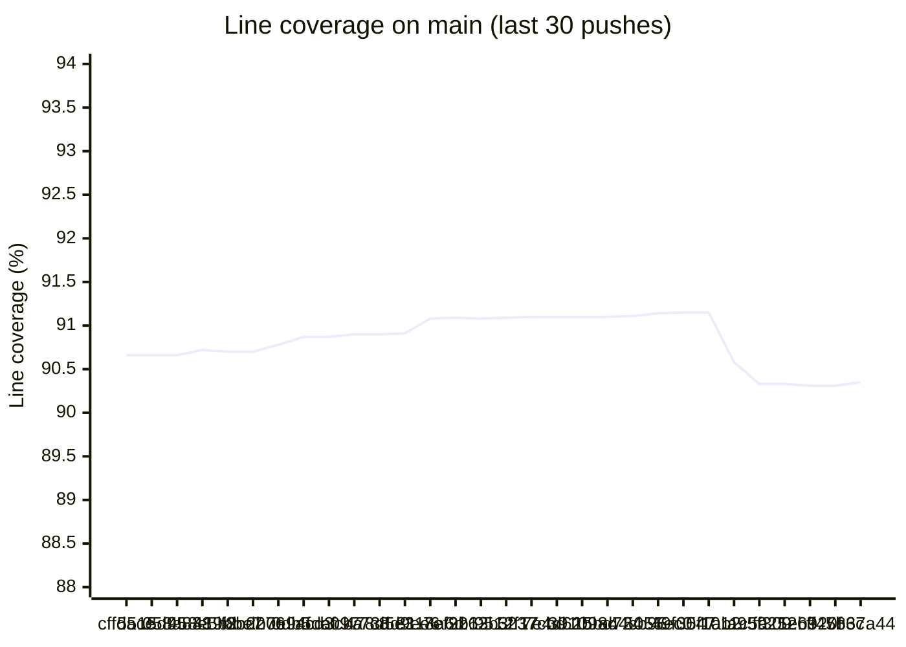

# Code coverage history

Line coverage of `src/eplugin-framework/addons/ePlugin` on `main`, recorded by the CI-PR workflow after every push. This branch is generated; do not edit it.

**90.35%** (12072 of 13362 lines) at [7837a44](https://github.com/enaweg/godot-epluginframework/commit/7837a44fe51863adceaa4b53212bb51c2d2d9203), 2026-10-29.

```mermaid
xychart-beta
    title "Line coverage on main (last 30 pushes)"
    x-axis ["cffdace", "5515d95", "058a838", "458e5b2", "419bbe7", "f8bd276", "2b0e94f", "0db5daf", "acd3cba", "e0977c8", "478d5e3", "3dd9ee6", "8118a6d", "7ef2262", "9b13b3f", "9512f17", "5237cbd", "7e4d62b", "391098c", "15bd724", "a44cb96", "5055ec0", "49f0047", "35f1ab2", "1011c5a", "a95f309", "f925263", "1eb920f", "ff45b6c", "7837a44"]
    y-axis "Line coverage (%)" 88 --> 94
    line [90.66, 90.66, 90.66, 90.72, 90.70, 90.70, 90.78, 90.87, 90.87, 90.90, 90.90, 90.91, 91.08, 91.09, 91.08, 91.09, 91.10, 91.10, 91.10, 91.10, 91.11, 91.14, 91.15, 91.15, 90.58, 90.33, 90.33, 90.31, 90.31, 90.35]
```

| Date | Commit | Line coverage | Change |
|:--|:--|--:|--:|
| 2026-10-29 | [7837a44](https://github.com/enaweg/godot-epluginframework/commit/7837a44fe51863adceaa4b53212bb51c2d2d9203) | 90.35% | +0.04 pp |
| 2026-10-29 | [ff45b6c](https://github.com/enaweg/godot-epluginframework/commit/ff45b6c6cd2114e7faa315ff8ac3aeec3590d762) | 90.31% | +0.00 pp |
| 2026-10-29 | [1eb920f](https://github.com/enaweg/godot-epluginframework/commit/1eb920fd6ccc9ed7242312b34a76dee4e035a76e) | 90.31% | -0.02 pp |
| 2026-10-28 | [f925263](https://github.com/enaweg/godot-epluginframework/commit/f925263c61e1779386b829b29074d05e8f59e82e) | 90.33% | +0.00 pp |
| 2026-10-28 | [a95f309](https://github.com/enaweg/godot-epluginframework/commit/a95f309c95449a422203860c2b867b7ec8442eb2) | 90.33% | -0.25 pp |
| 2026-10-28 | [1011c5a](https://github.com/enaweg/godot-epluginframework/commit/1011c5a46a3ee8845656bab79350b5ef2bcf26ec) | 90.58% | -0.57 pp |
| 2026-10-27 | [35f1ab2](https://github.com/enaweg/godot-epluginframework/commit/35f1ab2b2803c044388d06ccaa0fad748622ec2b) | 91.15% | +0.00 pp |
| 2026-10-27 | [49f0047](https://github.com/enaweg/godot-epluginframework/commit/49f00479647b1966cbfc9ffa28a3936f5cd5bce4) | 91.15% | +0.01 pp |
| 2026-10-26 | [5055ec0](https://github.com/enaweg/godot-epluginframework/commit/5055ec0f97aa79d17390a792f963b84ae4c7f299) | 91.14% | +0.03 pp |
| 2026-10-26 | [a44cb96](https://github.com/enaweg/godot-epluginframework/commit/a44cb963be80bead366f40c51dec50fc41c9e911) | 91.11% | +0.01 pp |
| 2026-10-26 | [15bd724](https://github.com/enaweg/godot-epluginframework/commit/15bd724bedf34f9f33929ba566dc188b53f4e2c5) | 91.10% | +0.00 pp |
| 2026-10-26 | [391098c](https://github.com/enaweg/godot-epluginframework/commit/391098c5badca5f2ce7155f5332658f7fd268380) | 91.10% | +0.00 pp |
| 2026-10-25 | [7e4d62b](https://github.com/enaweg/godot-epluginframework/commit/7e4d62b8e2a38bbecd4d4a1fe3dc8c3d395e6174) | 91.10% | +0.00 pp |
| 2026-10-25 | [5237cbd](https://github.com/enaweg/godot-epluginframework/commit/5237cbdf3003cc691fe9f4f1a9111186558155b1) | 91.10% | +0.01 pp |
| 2026-10-25 | [9512f17](https://github.com/enaweg/godot-epluginframework/commit/9512f175db8865f82d1940c19773c986f9dcf6cc) | 91.09% | +0.01 pp |
| 2026-10-25 | [9b13b3f](https://github.com/enaweg/godot-epluginframework/commit/9b13b3f4aaad822e3b339ff52819b9ed91425a76) | 91.08% | -0.01 pp |
| 2026-10-25 | [7ef2262](https://github.com/enaweg/godot-epluginframework/commit/7ef226280f62784755211f9972b59c38708e3ac6) | 91.09% | +0.01 pp |
| 2026-10-25 | [8118a6d](https://github.com/enaweg/godot-epluginframework/commit/8118a6d95c68d3b19931aafc7b631c30bb0d5d0f) | 91.08% | +0.17 pp |
| 2026-10-25 | [3dd9ee6](https://github.com/enaweg/godot-epluginframework/commit/3dd9ee61da6f71bbb0fbd3c0895e16a2f5c8ac67) | 90.91% | +0.01 pp |
| 2026-10-25 | [478d5e3](https://github.com/enaweg/godot-epluginframework/commit/478d5e3f12b8d6f62517d80c1faaa450703c4f27) | 90.90% | +0.00 pp |
| 2026-10-25 | [e0977c8](https://github.com/enaweg/godot-epluginframework/commit/e0977c81c789ea6eb2e5b35853e60d9e3a817db4) | 90.90% | +0.03 pp |
| 2026-10-25 | [acd3cba](https://github.com/enaweg/godot-epluginframework/commit/acd3cba0c55856981d6f8a3a8ae033054487120d) | 90.87% | +0.00 pp |
| 2026-10-25 | [0db5daf](https://github.com/enaweg/godot-epluginframework/commit/0db5dafb8c32b3d416d7a6202ccab37b22d98a52) | 90.87% | +0.09 pp |
| 2026-10-25 | [2b0e94f](https://github.com/enaweg/godot-epluginframework/commit/2b0e94f888db40a19927f2d1e8e0b7f7962dedf4) | 90.78% | +0.08 pp |
| 2026-10-25 | [f8bd276](https://github.com/enaweg/godot-epluginframework/commit/f8bd2763202c939e23a41cbc61d1dcaa39fcf312) | 90.70% | +0.00 pp |
| 2026-10-25 | [419bbe7](https://github.com/enaweg/godot-epluginframework/commit/419bbe77c30fb0ae4558e7447841ce7fce2bb781) | 90.70% | -0.02 pp |
| 2026-10-24 | [458e5b2](https://github.com/enaweg/godot-epluginframework/commit/458e5b24696bfa78295d5c1b44e5e93efabf9fa7) | 90.72% | +0.06 pp |
| 2026-10-24 | [058a838](https://github.com/enaweg/godot-epluginframework/commit/058a838a4d69344f49bb378b612bfa11e3899499) | 90.66% | +0.00 pp |
| 2026-10-24 | [5515d95](https://github.com/enaweg/godot-epluginframework/commit/5515d9505b71cde85498a00b38558c94a0e1d9f8) | 90.66% | +0.00 pp |
| 2026-10-24 | [cffdace](https://github.com/enaweg/godot-epluginframework/commit/cffdace7e70b0bfb52190f4fb8c9ec369e95f251) | 90.66% | +0.00 pp |

All measurements: [history.csv](history.csv).

Files at 7837a44 (141)

| File | Line coverage | Covered lines |
|:--|--:|--:|
| `Internal/ExportFilter.cs` | 0.0% | 0 of 4 |
| `Internal/ProjectSettingsDialog.cs` | 9.4% | 5 of 53 |
| `EPlugin.cs` | 33.3% | 4 of 12 |
| `Internal/AssemblyUnloadCleanup.cs` | 38.9% | 7 of 18 |
| `EPluginPlugin.cs` | 58.8% | 200 of 340 |
| `Internal/EditorHost.cs` | 59.3% | 51 of 86 |
| `Internal/Manager/EditorWindows.cs` | 61.8% | 42 of 68 |
| `Internal/EGlobal.UpdateApply.cs` | 64.3% | 187 of 291 |
| `Internal/Manager/EPluginManagerDialog.Operations.cs` | 69.1% | 103 of 149 |
| `Internal/Manager/StartupFailureDialog.cs` | 71.1% | 32 of 45 |
| `Internal/PluginTypes.cs` | 71.4% | 15 of 21 |
| `Internal/Manager/EPluginManagerDialog.Versions.cs` | 71.7% | 81 of 113 |
| `Internal/Manager/GeneralSettingsTab.cs` | 74.7% | 56 of 75 |
| `Logging/GodotConsoleLogger.cs` | 76.7% | 33 of 43 |
| `Internal/EGlobal.Transitions.cs` | 77.2% | 146 of 189 |
| `Internal/ProgressSession.cs` | 78.8% | 171 of 217 |
| `Internal/Manager/CleanupSuggestionDialog.cs` | 78.9% | 30 of 38 |
| `Internal/EGlobal.LocalSources.cs` | 79.3% | 46 of 58 |
| `Internal/Manager/EPluginManagerDialog.Updates.cs` | 81.0% | 47 of 58 |
| `Internal/Manager/UpdateReviewDialog.cs` | 82.1% | 78 of 95 |
| `Internal/EGlobal.AddonInstall.cs` | 82.4% | 28 of 34 |
| `Internal/ActivationProgress.cs` | 82.7% | 253 of 306 |
| `Internal/Dotnet/DotnetFailure.cs` | 83.7% | 36 of 43 |
| `Internal/EGlobal.Updates.cs` | 83.9% | 135 of 161 |
| `Internal/Manager/EPluginManagerDialog.Zip.cs` | 84.5% | 71 of 84 |
| `Internal/Manager/EPluginManagerDialog.cs` | 85.2% | 363 of 426 |
| `Internal/EGlobal.PluginManager.cs` | 85.4% | 76 of 89 |
| `Internal/AssemblyReload.cs` | 85.7% | 24 of 28 |
| `Internal/Manager/WelcomeDialog.cs` | 85.7% | 54 of 63 |
| `Internal/Update/AddonInstaller.cs` | 85.9% | 61 of 71 |
| `Internal/EGlobal.Retry.cs` | 86.2% | 138 of 160 |
| `Internal/Update/UpdateErrors.cs` | 86.3% | 82 of 95 |
| `Internal/EGlobal.cs` | 86.4% | 267 of 309 |
| `EditorPluginExtensions.cs` | 87.3% | 62 of 71 |
| `Internal/Manager/UpdateFailureDialog.cs` | 87.3% | 69 of 79 |
| `Internal/EGlobal.UpdateWorkflow.cs` | 87.5% | 7 of 8 |
| `Internal/Welcomes/PluginWelcome.cs` | 87.9% | 29 of 33 |
| `Internal/Kinds/GDExtensionRules.cs` | 88.2% | 30 of 34 |
| `Internal/Manager/SettingsDialog.cs` | 88.5% | 46 of 52 |
| `Internal/Manager/ToolsTab.cs` | 89.3% | 208 of 233 |
| `Internal/EGlobal.Activation.cs` | 89.5% | 299 of 334 |
| `Internal/EGlobal.RecipeOperations.cs` | 89.6% | 112 of 125 |
| `Internal/Kinds/NativeExtensionStatus.cs` | 89.7% | 26 of 29 |
| `Internal/EGlobal.MissingPlugins.cs` | 90.6% | 29 of 32 |
| `Internal/EGlobal.PlainPlugins.cs` | 90.9% | 130 of 143 |
| `Internal/Licenses/PluginLicense.cs` | 91.1% | 41 of 45 |
| `Internal/Update/AddonSwap.cs` | 91.2% | 114 of 125 |
| `Internal/Update/UpdateApplier.cs` | 91.7% | 431 of 470 |
| `Internal/Manager/LicenseDialog.cs` | 92.0% | 150 of 163 |
| `Internal/Update/UpdateStateStore.cs` | 92.6% | 50 of 54 |
| `Internal/Manager/UpdateSourcesTab.cs` | 93.1% | 285 of 306 |
| `Internal/EGlobal.Welcomes.cs` | 93.3% | 70 of 75 |
| `Internal/Manager/AttentionDialog.cs` | 93.5% | 115 of 123 |
| `Internal/ShowHideHelper.cs` | 93.6% | 103 of 110 |
| `Internal/Manager/ManagerReopenMarker.cs` | 94.1% | 16 of 17 |
| `Internal/Update/GitSource.cs` | 94.3% | 199 of 211 |
| `Internal/Update/PluginCode.cs` | 94.7% | 18 of 19 |
| `Internal/Manager/EditorIcons.cs` | 94.8% | 55 of 58 |
| `Internal/Dotnet/ProjectReferences.cs` | 95.0% | 38 of 40 |
| `Internal/Update/InterimBridge.cs` | 95.7% | 45 of 47 |
| `Internal/PluginStateStore.cs` | 96.0% | 498 of 519 |
| `Internal/Update/LocalIndexCache.cs` | 96.0% | 24 of 25 |
| `Internal/Dotnet/NugetConfigManager.cs` | 96.2% | 200 of 208 |
| `Internal/Kinds/PluginKinds.cs` | 96.2% | 50 of 52 |
| `Internal/Update/PackageFetcher.cs` | 96.2% | 100 of 104 |
| `Internal/Manager/UpdateFlow.cs` | 96.2% | 227 of 236 |
| `Internal/EGlobal.Deactivation.cs` | 96.3% | 130 of 135 |
| `Internal/Kinds/GDExtensionPluginWorkflow.cs` | 96.3% | 78 of 81 |
| `Internal/Update/BuildDiagnostics.cs` | 96.3% | 52 of 54 |
| `Internal/EGlobal.OptionalDependencies.cs` | 96.4% | 108 of 112 |
| `Internal/Dotnet/XmlFile.cs` | 96.5% | 55 of 57 |
| `Internal/EGlobal.Licenses.cs` | 96.5% | 279 of 289 |
| `Internal/Update/SafeZipExtractor.cs` | 96.7% | 88 of 91 |
| `Internal/Update/UpdateService.cs` | 96.7% | 119 of 123 |
| `Internal/Update/UpdateModels.cs` | 96.9% | 62 of 64 |
| `Internal/Manager/PluginAttention.cs` | 97.2% | 103 of 106 |
| `Internal/Dotnet/ExecuteCliBase.cs` | 97.3% | 36 of 37 |
| `Internal/Update/UpdateRecovery.cs` | 97.4% | 151 of 155 |
| `Internal/Manager/ZipInstall.cs` | 97.8% | 44 of 45 |
| `Internal/Update/LocalPackageIndex.cs` | 97.9% | 92 of 94 |
| `Internal/Update/RecipeReconciler.cs` | 98.0% | 50 of 51 |
| `Internal/Dotnet/BuildOutputGuard.cs` | 98.1% | 52 of 53 |
| `Internal/Manager/PluginManagerViewModel.cs` | 98.2% | 269 of 274 |
| `Internal/Dotnet/ReleaseConfiguration.cs` | 98.6% | 71 of 72 |
| `Internal/Update/AddonPackageValidator.cs` | 98.7% | 150 of 152 |
| `Internal/Dotnet/DotnetCli10.cs` | 98.8% | 81 of 82 |
| `Internal/Dotnet/DotnetCli9.cs` | 98.8% | 81 of 82 |
| `Internal/EGlobal.UpdateRecipes.cs` | 98.9% | 188 of 190 |
| `Internal/Update/ReleaseSources.cs` | 99.0% | 195 of 197 |
| `Internal/Update/LocalCleanup.cs` | 99.0% | 98 of 99 |
| `Internal/Update/PackageFiles.cs` | 99.0% | 104 of 105 |
| `Internal/Update/UpdateHttp.cs` | 99.2% | 120 of 121 |
| `Internal/Kinds/GDExtensionConfig.cs` | 99.4% | 165 of 166 |
| `EEditorPluginMetadata.cs` | 100.0% | 4 of 4 |
| `IEEditorPluginExtensions.cs` | 100.0% | 15 of 15 |
| `Internal/Dotnet/DotnetCliBase.cs` | 100.0% | 80 of 80 |
| `Internal/Dotnet/DotnetVersionManager.cs` | 100.0% | 39 of 39 |
| `Internal/Dotnet/ICheckedDotnetCli.cs` | 100.0% | 1 of 1 |
| `Internal/Dotnet/PluginsOnlyBuild.cs` | 100.0% | 32 of 32 |
| `Internal/EEditorPluginBuilder.cs` | 100.0% | 69 of 69 |
| `Internal/EEditorPluginRecipe.cs` | 100.0% | 13 of 13 |
| `Internal/EEditorPluginSubRecipeBuilder.cs` | 100.0% | 35 of 35 |
| `Internal/EGlobal.ExtensionAddons.cs` | 100.0% | 19 of 19 |
| `Internal/EGlobal.LocalCleanup.cs` | 100.0% | 20 of 20 |
| `Internal/EGlobal.UpdateSites.cs` | 100.0% | 28 of 28 |
| `Internal/EPluginProgress.cs` | 100.0% | 1 of 1 |
| `Internal/ExportExclusions.cs` | 100.0% | 8 of 8 |
| `Internal/Kinds/CSharpPluginWorkflow.cs` | 100.0% | 4 of 4 |
| `Internal/Kinds/EPluginWorkflow.cs` | 100.0% | 14 of 14 |
| `Internal/Kinds/FrameworkPluginWorkflow.cs` | 100.0% | 7 of 7 |
| `Internal/Kinds/GDScriptPluginWorkflow.cs` | 100.0% | 4 of 4 |
| `Internal/Kinds/PluginKindWorkflow.cs` | 100.0% | 13 of 13 |
| `Internal/Kinds/UnknownPluginWorkflow.cs` | 100.0% | 4 of 4 |
| `Internal/Licenses/LicenseReview.cs` | 100.0% | 47 of 47 |
| `Internal/Licenses/LicenseSettings.cs` | 100.0% | 9 of 9 |
| `Internal/LoggingSettings.cs` | 100.0% | 9 of 9 |
| `Internal/Manager/AboutTab.cs` | 100.0% | 58 of 58 |
| `Internal/Manager/EditorSignalConnections.cs` | 100.0% | 12 of 12 |
| `Internal/Manager/ObservedTask.cs` | 100.0% | 4 of 4 |
| `Internal/Manager/PluginCatalog.cs` | 100.0% | 11 of 11 |
| `Internal/Manager/TextColors.cs` | 100.0% | 11 of 11 |
| `Internal/Manager/UpdateReview.cs` | 100.0% | 71 of 71 |
| `Internal/PlainPluginObserver.cs` | 100.0% | 74 of 74 |
| `Internal/PluginContext.cs` | 100.0% | 14 of 14 |
| `Internal/PluginToggles.cs` | 100.0% | 13 of 13 |
| `Internal/RecipeEntries.cs` | 100.0% | 69 of 69 |
| `Internal/Update/AddonArchive.cs` | 100.0% | 48 of 48 |
| `Internal/Update/KnownPlugins.Data.cs` | 100.0% | 1043 of 1043 |
| `Internal/Update/KnownPlugins.cs` | 100.0% | 6 of 6 |
| `Internal/Update/LocalSourceSettings.cs` | 100.0% | 56 of 56 |
| `Internal/Update/RecipeSnapshot.cs` | 100.0% | 27 of 27 |
| `Internal/Update/SemVer.cs` | 100.0% | 46 of 46 |
| `Internal/Update/UidMap.cs` | 100.0% | 10 of 10 |
| `Internal/Update/UpdateGroups.cs` | 100.0% | 20 of 20 |
| `Internal/Update/UpdateJournal.cs` | 100.0% | 68 of 68 |
| `Internal/Update/UpdateSettings.cs` | 100.0% | 18 of 18 |
| `Internal/Update/UpdateSiteSettings.cs` | 100.0% | 52 of 52 |
| `Internal/VersionConstraint.cs` | 100.0% | 25 of 25 |
| `Internal/Welcomes/WelcomeSettings.cs` | 100.0% | 9 of 9 |
| `Logging/GenericLoggerFactory.cs` | 100.0% | 7 of 7 |
| `Logging/NullLogger.cs` | 100.0% | 6 of 6 |

