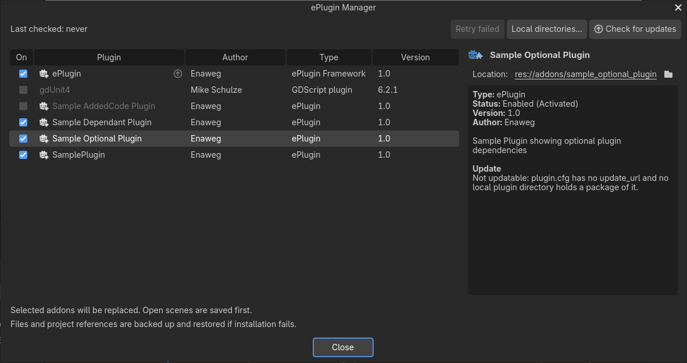

# ePlugin Manager

Open **ePlugin Manager** with the ePlugin button at the right of the editor's main toolbar or from **Project > Tools > ePlugin Manager...**.

The overview above uses the repository's sample plugins in Godot's default dark editor theme.

The manager lists plugins below `res://addons`, whether they are enabled or not. It shows each plugin's author, type (ePlugin Framework, ePlugin, C# plugin, or GDScript plugin), version, and enabled state. ePlugins have the ePlugin icon. A plugin with an `update_url` or a matching local package gets an update indicator when a newer version is available; the Version column shows the installed and available versions and lets you select updates.

Select a plugin to see its status, author, documentation and source links, license, description, update source and warnings, earlier failures, and the dependencies declared by an active ePlugin recipe. Click the license to read it again; a plugin without a license of its own shows its missing `LICENSE` file as missing. A plugin with a [welcome page](plugin-welcome.md) links it as well, so it can be read again after it was shown. Click the plugin location to select it in the FileSystem dock, or use the folder button to open it in the system file manager. Documentation, source, update site and release page links open in the system browser. Plugins provide documentation and source links with `documentation_url` and `source_url` in `plugin.cfg` (see [Create an ePlugin](creating-plugins.md#documentation-and-source-links)).

## Actions

- **On** enables or disables the selected plugin. Enabling an ePlugin installs its recipe and required dependencies. Plugins that ask for their [license](plugin-licenses.md) to be accepted show it first. Once installed, a plugin shows its [welcome page](plugin-welcome.md) if it has one and it was not shown for the project yet. Disabling a plugin also disables plugins that require it. The manager refreshes the list after toggles. Disabling ePlugin Framework itself requires confirmation because it closes the manager.
- **Check for updates** checks immediately regardless of the scheduled interval and indexes local plugin directories again.
- **Local directories...** adds, removes, or rescans folders containing plugin ZIP packages. The folders are user-wide settings; see [Updating plugins](updating-plugins.md#local-plugin-directories).
- **Update** installs the checked updates after validation and confirmation. See [Updating plugins](updating-plugins.md).
- **Retry failed** retries activation, deactivation, or update work that failed or was interrupted. See [Plugin state files](plugin-state.md).
- **Open release page** opens the release notes for the selected update.
- **Version** selects a published version for an enabled plugin with an `update_url` or a package in a local plugin directory. Choose **Update** or **Downgrade** to install it. Downgrades use the same download, validation, backup, and rollback flow as updates. The ePlugin Framework itself cannot be downgraded because an older framework cannot complete or recover the update that installs it.

## Scheduled checks

By default, update checks run once per editor session when the last successful check is at least 20 hours old. The manager's **Check for updates** action bypasses that interval. Update settings are under **Project Settings > eplugin/updates**; the available settings are described in [Updating plugins](updating-plugins.md#update-settings).
