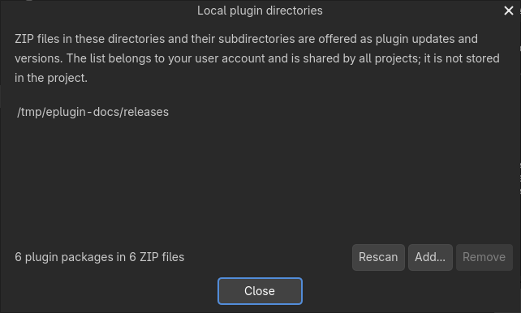
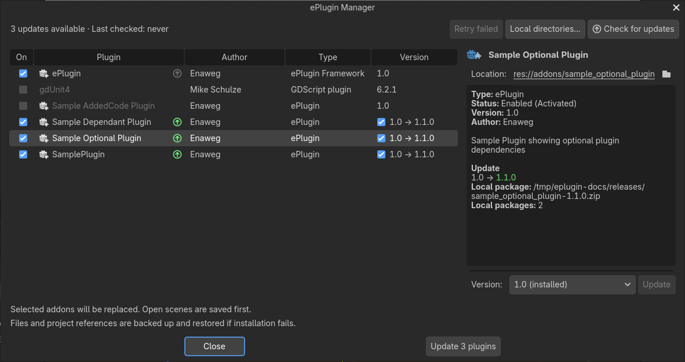

# Updating plugins

Plugins can publish updates from GitHub or GitLab releases, a Git source, or ZIP packages in a local plugin directory. Update checks report candidates; they do not install anything until you select packages in the [ePlugin Manager](eplugin-manager.md) and choose **Update**.

## Configure an update source

Add `update_url` to the `[plugin]` section of `plugin.cfg`:

```ini
[plugin]
name="My plugin"
version="1.2.0"
script="MyPlugin.cs"
update_url="https://github.com/owner/repository/releases"
```

This works for enabled ePlugins, plain Godot GDScript or C# plugins, and ePlugin Framework itself. Checks compare the source version with the version in the installed `plugin.cfg`, independently of the last working version in `addons/eplugin-state.json`. A manual version edit does not block checks; an unfinished local attempt does. The `update_url` is read from the installed `plugin.cfg`, so each release must declare it again; see [Review before installation](#review-before-installation) for an `update_url` added to someone else's plugin.

Supported source examples:

| Source | Example |
|---|---|
| GitHub releases | `https://github.com/owner/repository/releases` |
| GitLab releases, including self-hosted instances | `https://gitlab.example/group/subgroup/repository/-/releases` |
| Git subtree tracking a branch | `https://host/owner/repository.git?path=addons/my_plugin#main` |
| Git over SSH | `git@host:owner/repository.git?path=addons/my_plugin#main` |
| Local plugin directories | ZIP files in folders you choose; no `update_url` required |

Release sources select the highest semantic version and a ZIP asset. If there are several assets, the updater prefers a slug-, addon-, or plugin-named ZIP; if none is suitable, it uses the release source archive. Ambiguous asset lists are refused. Git sources without a `#ref` choose the newest semantic tag, falling back to the default branch. A branch follows its tip; a tag or full commit SHA pins the source and opts out of update checks. Checks are version-based, so changing a commit without increasing `plugin.cfg`'s version does not offer an update.

Git sources require **git 2.25 or newer** on PATH. Fetches use shallow, partial, sparse checkout of the requested subtree. Servers that do not advertise partial-clone filtering are refused. Git release checks can read remote metadata directly; other Git checks fetch only the metadata blob. Release ZIP sources do not require git.

For private release APIs, set `EPLUGIN_GITHUB_TOKEN` (fallback `GITHUB_TOKEN`) or `EPLUGIN_GITLAB_TOKEN` (fallback `GITLAB_TOKEN`) in the editor environment. Tokens are not written to project files or caches. HTTP credentials are scoped to the source host and stripped on redirects to another host. Git authentication uses normal Git or SSH credentials and runs without interactive prompts.

## Local plugin directories

Local directories provide ZIP packages from a folder, network share, or downloaded release collection. Add them with **Local directories...** in the [ePlugin Manager](eplugin-manager.md). The list is stored in `eplugin/local-sources.json` in the Godot editor's user configuration folder, shared by projects, and never written to a project. A missing directory remains in the list for when a drive or share returns.



At editor startup and after C# assembly reloads, the framework indexes `*.zip` files in these directories and their subdirectories in the background. It reads each archive's file list and `plugin.cfg`, not the full archive. A cache in `eplugin/local-index.json` remembers each ZIP's metadata, so only new or changed ZIPs are opened again. Deleting the cache is safe. Adding or removing a directory, choosing **Rescan**, or selecting **Check for updates** indexes again. Hidden and system folders and folder links are skipped. ZIPs without a `plugin.cfg` are ignored; unreadable archives appear in the dialog with a status and are logged when first found.

A ZIP holds one plugin. The plugin root is the folder of its shallowest `plugin.cfg`, and that folder name is the plugin slug, for example `addons/my_plugin/` or `my_plugin/`. Deeper `plugin.cfg` files are sub-plugins and ship with it. A `plugin.cfg` at the archive root, or any other plugin root, makes the ZIP ambiguous and it will not be indexed. Local packages also work for plugins without an `update_url`. If both sources provide a version, the higher version wins and a local package wins a tie. Local packages use the same validation, backup, and rollback as downloads; their files are read in place and never changed.

## Publish an updatable release

Keep the addon slug stable and include `plugin.cfg` and its entry script. A ZIP must contain exactly one plugin root. The folder containing its shallowest `plugin.cfg` should be named for the slug (such as `addons/<slug>/`), unless it is at the archive root or inside one wrapper folder, as in a repository source archive. Nested `plugin.cfg` files below the plugin root belong to sub-plugins; any other plugin root makes the package ambiguous.

Packages may not contain symlinks, submodules, `project.godot`, or `nuget.config`. New `.csproj`, `.sln`, and `.slnx` paths are refused, though existing addon project paths can be updated. Downloads are limited to 256 MiB; extracted packages to 512 MiB, 20,000 files, and 256 MiB per file. Plugins containing `.gdextension` files, including installed native payloads, are currently refused.

Bump `version` for every release. Versions accept `1.2` or `1.2.3`, an optional leading `v`, and semantic prerelease/build suffixes. Prereleases are excluded by default. The staged `plugin.cfg` version must be newer than the installed one; if it differs from the release tag, the manager reports the difference for review.

For ePlugin recipes:

1. Keep root code compilable using only Godot and ePlugin. Code needing new NuGet packages or project references belongs in managed directories or projects declared by the recipe.
2. Ship managed source directories in hidden form, such as `.src`.
3. Keep `CreateRecipe` deterministic and free of side effects. During an update, the framework loads the new assembly and reconciles the old and new declarations.
4. Treat public API changes as changes that may require updates in users' game code. Major updates show a warning; hard dependency constraints that reject the new version block the update.

An enabled ePlugin stays enabled during its update. Its existing visible resources remain available for an interim build; the new recipe is reconciled before the final build. Plain plugins are temporarily toggled during the swap. Optional recipes that stop matching are reported and retained until their owning plugin is toggled; newly satisfied optional recipes are applied during reconciliation.

Before swapping addon files, the updater saves and closes open scenes so no scene keeps nodes whose scripts or resources are missing during the change. Untitled scenes cannot be saved, so an update will not start while one is open. Closing scenes requires Godot 4.5 or newer; on Godot 4.4 scenes are saved but remain open. Reopen scenes after the update.

## Checks and installation

The update list is part of ePlugin Manager. Select updates with the checkboxes in the **Version** column, then use the bottom **Update** button to install the batch.



This screenshot uses example local ZIP releases of the repository's sample plugins; the displayed update versions are sample data.

By default, the framework checks once per editor session when the last successful check was at least 20 hours ago. Results and the timestamp are cached under `.godot/eplugin/update-state.json`. The manager's **Check for updates** action bypasses the interval and also indexes local directories. Settings are under **Project Settings > eplugin/updates**.

The manager shows installed and candidate versions, sources, warnings, and earlier failures. Select a batch and choose **Update** to download and validate it. Package warnings require another confirmation before installation; a changed source host requires the explicit trust checkbox. Canceling the download leaves installed addons untouched. An update that comes with a license file not accepted yet shows it before installation; an update that keeps the accepted license file does not ask again (see [Plugin licenses](plugin-licenses.md#updates)). Updates never show a plugin's [welcome page](plugin-welcome.md#updates). Previously failed versions are shown but are not selected automatically. The **Version** selector also supports installing an earlier published version as a downgrade, with the same validation, backup, and rollback flow.

Versions are listed from GitHub/GitLab releases (up to 100) or semantic tags of a Git source. A Git `update_url` pinned to a branch, tag, or commit has no version list. When the list loaded for the selected plugin contains a version newer than the installed one, the plugin shows that update right away, as if **Check for updates** had found it. Configure **Update** and **Downgrade** from [ePlugin Manager](eplugin-manager.md).

### Review before installation

**Update** first downloads and validates every package of the batch. Addon files are only changed afterwards. Installation stops for a review when a package has a warning or when its update source moves to another host. The warnings are listed in the plugin's details under **Update** (or **Reviewed package** for a version chosen in the **Version** selector). Confirm again to install. A changed host also requires the trust checkbox.

| Warning | Reason |
|---|---|
| Package version differs from the announced version | The `version` in the package's `plugin.cfg` is not the version of the release or tag that offered it. |
| Plugin name changed | The package's `plugin.cfg` has a different `name`. |
| Update source changed | The package's `plugin.cfg` has a different `update_url`, or none. A different host requires the trust checkbox. |
| Plugin entry-point language changed | The `script` changed language, for example from `.gd` to `.cs`. |
| Major version change | The major version differs, so project code that uses the plugin may need changes. |

An update with an error cannot be selected or installed. These are refused:

- a package without a readable `plugin.cfg`, without `name`, `version` or `script`, or whose script is missing or outside the addon
- a package for a different addon slug
- a version that is not newer than the installed one. The **Version** selector can downgrade, except ePlugin Framework.
- a package or installed plugin with `.gdextension` files, a forbidden file, or a package over the size limits (see [Publish an updatable release](#publish-an-updatable-release))
- a version rejected by a hard dependency constraint of another enabled plugin
- a plugin whose update is changed or blocked: its `update_url` changed since the check, it is no longer enabled, or an earlier attempt needs **Retry failed** first

Shown without stopping: an optional recipe of another plugin that no longer matches the new version (it stays installed until that plugin is toggled), and the last working version recorded in `addons/eplugin-state.json` when it differs from the installed one.

> [!NOTE]
> An update replaces the whole addon folder, `plugin.cfg` included. If you added `update_url` to a third-party plugin yourself, its next release usually does not contain it: the review reports **Update source changed: removed**, and after installing, the plugin has no `update_url` until you add it again. Use a [local plugin directory](#local-plugin-directories) for plugins whose releases do not declare an `update_url`.

## Builds, restart, and recovery

Each batch has a durable journal, old addon trees, project backups, and build logs under `.godot/eplugin/updates/<id>/`. A local state marker is written before file changes. The shared `addons/eplugin-state.json` advances after the whole batch builds and verifies successfully. Commit that index with the updated addon files. Backups are removed after success; failed updates retain logs.

Interim build failures, installation failures, and self-update failures roll back automatically. A final build failure normally offers **Roll back**, **Keep new version**, and **Open build log**. Closing the dialog rolls back; closing the editor while a decision is pending preserves it for the next startup. Headless execution always rolls back. Keeping a failed version retains its backup and an `update_kept_build_failed` local marker without advancing the shared index. Fix the build and use **Retry failed** in the manager to verify and acknowledge it. If the shared index changed externally, merge it and retry acknowledgement.

C# updates may restart for the assembly handoff; managed C# recipes restart after their final build, and ePlugin Framework self-updates always restart. If automatic launch fails, reopen the project to resume its journal. Before a self-update swap, the progress helper closes to release Windows file locks. Early recovery runs before framework initialization: after two startups without a health marker, it restores the prior framework, rebuilds it, clears its local marker, and requests a restart.

If automatic recovery cannot run, close the editor, restore `updates/<id>/backup/<slug>` to `addons/<slug>` for each affected plugin, and restore files from `backup-project/` to the project root. Delete `.godot/mono/temp` and rebuild the solution. Reopen the editor and use **Retry failed** in the ePlugin Manager; keep the journal and local marker until recovery succeeds. Each transaction includes a `README.txt` with these steps.

## Update settings

| Setting | Default | Effect |
|---|---|---|
| `check_enabled` | `true` | Enables scheduled checks; manual checks remain available. |
| `check_interval_hours` | `20` | Minimum time between successful scheduled checks. |
| `allow_prerelease` | `false` | Includes semantic prereleases. |
| `on_build_failure` | `ask` | Final build policy: `ask`, `rollback`, or `keep`; self-updates and headless runs always roll back. |
| `restart_policy` | `auto` | Uses conservative C# restarts, or `always` to restart for every batch. |

Update journals and recipe snapshots use versioned, backward-compatible readers. Future framework releases must preserve that contract and keep the shared and local state schemas readable by a rolled-back framework. Unsupported future journals need manual repair. Updates do not install missing addons, resolve remote plugin dependencies, or run migration scripts.
